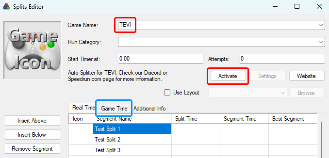
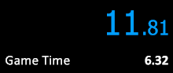

# LiveSplit.TEVI
TEVI Auto Splitter ASL Script for use with LiveSplit

General Notes
===  
- The TEVI Auto Splitter uses asl-help for its Unity functionality. It can auto start and reset runs, and it can split on bosses and items using the event and item flags. Music is also tracked and can be used as additional split checks.
- If you need to add additional splits, you can do so relatively easily by finding the proper IDs listed [here](https://rentry.co/TEVI_IDs).
- IGT is tracked automatically. You can check this by comparing to game time or by using the 'Alternative Timing Method' component of LiveSplit found [here]( https://github.com/Dalet/LiveSplit.AlternateTimingMethod/releases).

How to Use
===
> ⚠️ **You do NOT need to download anything from this repository.**
1. On your LiveSplit, right click > Edit Splits...
2. Enter "TEVI" as your Game Name, then hit "Activate" by the Auto-Splitter information. This should automatically download the necessary scripts to your LiveSplit/Components folder.
3. Hit "Settings" to view the split setting toggles.
4. Note that below in your splits, Game Time will be tracked as the second tab.

Adding Alternate Timing Method
---
1. Download the LiveSplit.AlternateTimingMethod component (zip folder) [here](https://github.com/Dalet/LiveSplit.AlternateTimingMethod/releases).
2. Extract the `LiveSplit.AlternateTimingMethod.dll` file to your LiveSplit/Components folder.
3. On your LiveSplit, right click > Edit Layout...
4. Add a component by hitting the big plus symbol > Information > Alternate Timing Method
5. You should now see "Game Time" on your layout. You can right click > Compare Against > Game Time to toggle your main timer and alt timer between RTA and LRT.

Troubleshooting
---
If you are experiencing issues with the Auto Splitter not splitting or splitting more than expected, please try the following steps:
1. Review what you have checked in your settings. It's possible that you've forgotten to check something or checked too many things.
2. Check your Layout Settings to see if you have a component called `Scriptable Auto Splitter` active; **remove it** if you do.
3. Restart your LiveSplit, Auto Splitter (deactive and reactivate), or Game.

> ⚠️ Please note that in order to properly check if things have fixed, you need to clear the script's saved variables before checking. You can do so with any of the methods below:
1. In your splits editor, deactive and re-activate the Auto Splitter; sometimes redownloading the files will help reload the script properly.
2. Restart your LiveSplit.
3. While the timer is running, return to the title screen and let the Auto Splitter automatically reset. 
    > Note: if it does not automatically reset, then the script is probably not being properly read or loaded (try the above methods).